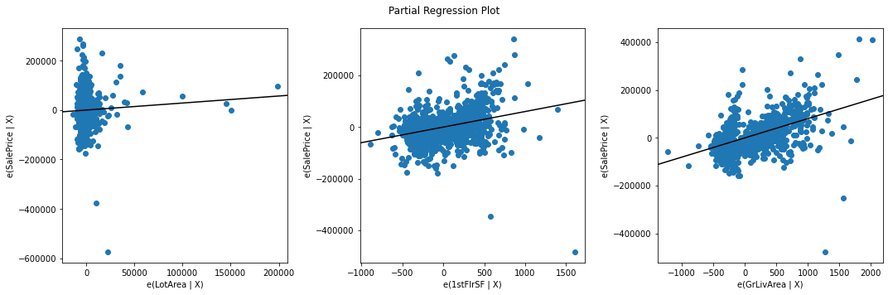

# Multiple Linear Regression in StatsModels - Lab

## Introduction
In this lab, you'll practice fitting a multiple linear regression model on the Ames Housing dataset!

## Objectives

You will be able to:

* Perform a multiple linear regression using StatsModels
* Visualize individual predictors within a multiple linear regression
* Interpret multiple linear regression coefficients from raw, un-transformed data

## The Ames Housing Dataset

The [Ames Housing dataset](http://jse.amstat.org/v19n3/decock.pdf) is a newer (2011) replacement for the classic Boston Housing dataset. Each record represents a residential property sale in Ames, Iowa. It contains many different potential predictors and the target variable is `SalePrice`.


```python
import pandas as pd
ames = pd.read_csv("ames.csv", index_col=0)
ames
```


```python
# __SOLUTION__
import pandas as pd
ames = pd.read_csv("ames.csv", index_col=0)
ames
```


<div>
<style scoped>
    .dataframe tbody tr th:only-of-type {
        vertical-align: middle;
    }

    .dataframe tbody tr th {
        vertical-align: top;
    }

    .dataframe thead th {
        text-align: right;
    }
</style>
<table border="1" class="dataframe">
  <thead>
    <tr style="text-align: right;">
      <th></th>
      <th>MSSubClass</th>
      <th>MSZoning</th>
      <th>LotFrontage</th>
      <th>LotArea</th>
      <th>Street</th>
      <th>Alley</th>
      <th>LotShape</th>
      <th>LandContour</th>
      <th>Utilities</th>
      <th>LotConfig</th>
      <th>...</th>
      <th>PoolArea</th>
      <th>PoolQC</th>
      <th>Fence</th>
      <th>MiscFeature</th>
      <th>MiscVal</th>
      <th>MoSold</th>
      <th>YrSold</th>
      <th>SaleType</th>
      <th>SaleCondition</th>
      <th>SalePrice</th>
    </tr>
    <tr>
      <th>Id</th>
      <th></th>
      <th></th>
      <th></th>
      <th></th>
      <th></th>
      <th></th>
      <th></th>
      <th></th>
      <th></th>
      <th></th>
      <th></th>
      <th></th>
      <th></th>
      <th></th>
      <th></th>
      <th></th>
      <th></th>
      <th></th>
      <th></th>
      <th></th>
      <th></th>
    </tr>
  </thead>
  <tbody>
    <tr>
      <th>1</th>
      <td>60</td>
      <td>RL</td>
      <td>65.0</td>
      <td>8450</td>
      <td>Pave</td>
      <td>NaN</td>
      <td>Reg</td>
      <td>Lvl</td>
      <td>AllPub</td>
      <td>Inside</td>
      <td>...</td>
      <td>0</td>
      <td>NaN</td>
      <td>NaN</td>
      <td>NaN</td>
      <td>0</td>
      <td>2</td>
      <td>2008</td>
      <td>WD</td>
      <td>Normal</td>
      <td>208500</td>
    </tr>
    <tr>
      <th>2</th>
      <td>20</td>
      <td>RL</td>
      <td>80.0</td>
      <td>9600</td>
      <td>Pave</td>
      <td>NaN</td>
      <td>Reg</td>
      <td>Lvl</td>
      <td>AllPub</td>
      <td>FR2</td>
      <td>...</td>
      <td>0</td>
      <td>NaN</td>
      <td>NaN</td>
      <td>NaN</td>
      <td>0</td>
      <td>5</td>
      <td>2007</td>
      <td>WD</td>
      <td>Normal</td>
      <td>181500</td>
    </tr>
    <tr>
      <th>3</th>
      <td>60</td>
      <td>RL</td>
      <td>68.0</td>
      <td>11250</td>
      <td>Pave</td>
      <td>NaN</td>
      <td>IR1</td>
      <td>Lvl</td>
      <td>AllPub</td>
      <td>Inside</td>
      <td>...</td>
      <td>0</td>
      <td>NaN</td>
      <td>NaN</td>
      <td>NaN</td>
      <td>0</td>
      <td>9</td>
      <td>2008</td>
      <td>WD</td>
      <td>Normal</td>
      <td>223500</td>
    </tr>
    <tr>
      <th>4</th>
      <td>70</td>
      <td>RL</td>
      <td>60.0</td>
      <td>9550</td>
      <td>Pave</td>
      <td>NaN</td>
      <td>IR1</td>
      <td>Lvl</td>
      <td>AllPub</td>
      <td>Corner</td>
      <td>...</td>
      <td>0</td>
      <td>NaN</td>
      <td>NaN</td>
      <td>NaN</td>
      <td>0</td>
      <td>2</td>
      <td>2006</td>
      <td>WD</td>
      <td>Abnorml</td>
      <td>140000</td>
    </tr>
    <tr>
      <th>5</th>
      <td>60</td>
      <td>RL</td>
      <td>84.0</td>
      <td>14260</td>
      <td>Pave</td>
      <td>NaN</td>
      <td>IR1</td>
      <td>Lvl</td>
      <td>AllPub</td>
      <td>FR2</td>
      <td>...</td>
      <td>0</td>
      <td>NaN</td>
      <td>NaN</td>
      <td>NaN</td>
      <td>0</td>
      <td>12</td>
      <td>2008</td>
      <td>WD</td>
      <td>Normal</td>
      <td>250000</td>
    </tr>
    <tr>
      <th>...</th>
      <td>...</td>
      <td>...</td>
      <td>...</td>
      <td>...</td>
      <td>...</td>
      <td>...</td>
      <td>...</td>
      <td>...</td>
      <td>...</td>
      <td>...</td>
      <td>...</td>
      <td>...</td>
      <td>...</td>
      <td>...</td>
      <td>...</td>
      <td>...</td>
      <td>...</td>
      <td>...</td>
      <td>...</td>
      <td>...</td>
      <td>...</td>
    </tr>
    <tr>
      <th>1456</th>
      <td>60</td>
      <td>RL</td>
      <td>62.0</td>
      <td>7917</td>
      <td>Pave</td>
      <td>NaN</td>
      <td>Reg</td>
      <td>Lvl</td>
      <td>AllPub</td>
      <td>Inside</td>
      <td>...</td>
      <td>0</td>
      <td>NaN</td>
      <td>NaN</td>
      <td>NaN</td>
      <td>0</td>
      <td>8</td>
      <td>2007</td>
      <td>WD</td>
      <td>Normal</td>
      <td>175000</td>
    </tr>
    <tr>
      <th>1457</th>
      <td>20</td>
      <td>RL</td>
      <td>85.0</td>
      <td>13175</td>
      <td>Pave</td>
      <td>NaN</td>
      <td>Reg</td>
      <td>Lvl</td>
      <td>AllPub</td>
      <td>Inside</td>
      <td>...</td>
      <td>0</td>
      <td>NaN</td>
      <td>MnPrv</td>
      <td>NaN</td>
      <td>0</td>
      <td>2</td>
      <td>2010</td>
      <td>WD</td>
      <td>Normal</td>
      <td>210000</td>
    </tr>
    <tr>
      <th>1458</th>
      <td>70</td>
      <td>RL</td>
      <td>66.0</td>
      <td>9042</td>
      <td>Pave</td>
      <td>NaN</td>
      <td>Reg</td>
      <td>Lvl</td>
      <td>AllPub</td>
      <td>Inside</td>
      <td>...</td>
      <td>0</td>
      <td>NaN</td>
      <td>GdPrv</td>
      <td>Shed</td>
      <td>2500</td>
      <td>5</td>
      <td>2010</td>
      <td>WD</td>
      <td>Normal</td>
      <td>266500</td>
    </tr>
    <tr>
      <th>1459</th>
      <td>20</td>
      <td>RL</td>
      <td>68.0</td>
      <td>9717</td>
      <td>Pave</td>
      <td>NaN</td>
      <td>Reg</td>
      <td>Lvl</td>
      <td>AllPub</td>
      <td>Inside</td>
      <td>...</td>
      <td>0</td>
      <td>NaN</td>
      <td>NaN</td>
      <td>NaN</td>
      <td>0</td>
      <td>4</td>
      <td>2010</td>
      <td>WD</td>
      <td>Normal</td>
      <td>142125</td>
    </tr>
    <tr>
      <th>1460</th>
      <td>20</td>
      <td>RL</td>
      <td>75.0</td>
      <td>9937</td>
      <td>Pave</td>
      <td>NaN</td>
      <td>Reg</td>
      <td>Lvl</td>
      <td>AllPub</td>
      <td>Inside</td>
      <td>...</td>
      <td>0</td>
      <td>NaN</td>
      <td>NaN</td>
      <td>NaN</td>
      <td>0</td>
      <td>6</td>
      <td>2008</td>
      <td>WD</td>
      <td>Normal</td>
      <td>147500</td>
    </tr>
  </tbody>
</table>
<p>1460 rows × 80 columns</p>
</div>


```python
ames.describe()
```


```python
# __SOLUTION__
ames.describe()
```


<div>
<style scoped>
    .dataframe tbody tr th:only-of-type {
        vertical-align: middle;
    }

    .dataframe tbody tr th {
        vertical-align: top;
    }

    .dataframe thead th {
        text-align: right;
    }
</style>
<table border="1" class="dataframe">
  <thead>
    <tr style="text-align: right;">
      <th></th>
      <th>MSSubClass</th>
      <th>LotFrontage</th>
      <th>LotArea</th>
      <th>OverallQual</th>
      <th>OverallCond</th>
      <th>YearBuilt</th>
      <th>YearRemodAdd</th>
      <th>MasVnrArea</th>
      <th>BsmtFinSF1</th>
      <th>BsmtFinSF2</th>
      <th>...</th>
      <th>WoodDeckSF</th>
      <th>OpenPorchSF</th>
      <th>EnclosedPorch</th>
      <th>3SsnPorch</th>
      <th>ScreenPorch</th>
      <th>PoolArea</th>
      <th>MiscVal</th>
      <th>MoSold</th>
      <th>YrSold</th>
      <th>SalePrice</th>
    </tr>
  </thead>
  <tbody>
    <tr>
      <th>count</th>
      <td>1460.000000</td>
      <td>1201.000000</td>
      <td>1460.000000</td>
      <td>1460.000000</td>
      <td>1460.000000</td>
      <td>1460.000000</td>
      <td>1460.000000</td>
      <td>1452.000000</td>
      <td>1460.000000</td>
      <td>1460.000000</td>
      <td>...</td>
      <td>1460.000000</td>
      <td>1460.000000</td>
      <td>1460.000000</td>
      <td>1460.000000</td>
      <td>1460.000000</td>
      <td>1460.000000</td>
      <td>1460.000000</td>
      <td>1460.000000</td>
      <td>1460.000000</td>
      <td>1460.000000</td>
    </tr>
    <tr>
      <th>mean</th>
      <td>56.897260</td>
      <td>70.049958</td>
      <td>10516.828082</td>
      <td>6.099315</td>
      <td>5.575342</td>
      <td>1971.267808</td>
      <td>1984.865753</td>
      <td>103.685262</td>
      <td>443.639726</td>
      <td>46.549315</td>
      <td>...</td>
      <td>94.244521</td>
      <td>46.660274</td>
      <td>21.954110</td>
      <td>3.409589</td>
      <td>15.060959</td>
      <td>2.758904</td>
      <td>43.489041</td>
      <td>6.321918</td>
      <td>2007.815753</td>
      <td>180921.195890</td>
    </tr>
    <tr>
      <th>std</th>
      <td>42.300571</td>
      <td>24.284752</td>
      <td>9981.264932</td>
      <td>1.382997</td>
      <td>1.112799</td>
      <td>30.202904</td>
      <td>20.645407</td>
      <td>181.066207</td>
      <td>456.098091</td>
      <td>161.319273</td>
      <td>...</td>
      <td>125.338794</td>
      <td>66.256028</td>
      <td>61.119149</td>
      <td>29.317331</td>
      <td>55.757415</td>
      <td>40.177307</td>
      <td>496.123024</td>
      <td>2.703626</td>
      <td>1.328095</td>
      <td>79442.502883</td>
    </tr>
    <tr>
      <th>min</th>
      <td>20.000000</td>
      <td>21.000000</td>
      <td>1300.000000</td>
      <td>1.000000</td>
      <td>1.000000</td>
      <td>1872.000000</td>
      <td>1950.000000</td>
      <td>0.000000</td>
      <td>0.000000</td>
      <td>0.000000</td>
      <td>...</td>
      <td>0.000000</td>
      <td>0.000000</td>
      <td>0.000000</td>
      <td>0.000000</td>
      <td>0.000000</td>
      <td>0.000000</td>
      <td>0.000000</td>
      <td>1.000000</td>
      <td>2006.000000</td>
      <td>34900.000000</td>
    </tr>
    <tr>
      <th>25%</th>
      <td>20.000000</td>
      <td>59.000000</td>
      <td>7553.500000</td>
      <td>5.000000</td>
      <td>5.000000</td>
      <td>1954.000000</td>
      <td>1967.000000</td>
      <td>0.000000</td>
      <td>0.000000</td>
      <td>0.000000</td>
      <td>...</td>
      <td>0.000000</td>
      <td>0.000000</td>
      <td>0.000000</td>
      <td>0.000000</td>
      <td>0.000000</td>
      <td>0.000000</td>
      <td>0.000000</td>
      <td>5.000000</td>
      <td>2007.000000</td>
      <td>129975.000000</td>
    </tr>
    <tr>
      <th>50%</th>
      <td>50.000000</td>
      <td>69.000000</td>
      <td>9478.500000</td>
      <td>6.000000</td>
      <td>5.000000</td>
      <td>1973.000000</td>
      <td>1994.000000</td>
      <td>0.000000</td>
      <td>383.500000</td>
      <td>0.000000</td>
      <td>...</td>
      <td>0.000000</td>
      <td>25.000000</td>
      <td>0.000000</td>
      <td>0.000000</td>
      <td>0.000000</td>
      <td>0.000000</td>
      <td>0.000000</td>
      <td>6.000000</td>
      <td>2008.000000</td>
      <td>163000.000000</td>
    </tr>
    <tr>
      <th>75%</th>
      <td>70.000000</td>
      <td>80.000000</td>
      <td>11601.500000</td>
      <td>7.000000</td>
      <td>6.000000</td>
      <td>2000.000000</td>
      <td>2004.000000</td>
      <td>166.000000</td>
      <td>712.250000</td>
      <td>0.000000</td>
      <td>...</td>
      <td>168.000000</td>
      <td>68.000000</td>
      <td>0.000000</td>
      <td>0.000000</td>
      <td>0.000000</td>
      <td>0.000000</td>
      <td>0.000000</td>
      <td>8.000000</td>
      <td>2009.000000</td>
      <td>214000.000000</td>
    </tr>
    <tr>
      <th>max</th>
      <td>190.000000</td>
      <td>313.000000</td>
      <td>215245.000000</td>
      <td>10.000000</td>
      <td>9.000000</td>
      <td>2010.000000</td>
      <td>2010.000000</td>
      <td>1600.000000</td>
      <td>5644.000000</td>
      <td>1474.000000</td>
      <td>...</td>
      <td>857.000000</td>
      <td>547.000000</td>
      <td>552.000000</td>
      <td>508.000000</td>
      <td>480.000000</td>
      <td>738.000000</td>
      <td>15500.000000</td>
      <td>12.000000</td>
      <td>2010.000000</td>
      <td>755000.000000</td>
    </tr>
  </tbody>
</table>
<p>8 rows × 37 columns</p>
</div>


We will focus specifically on a subset of the overall dataset. These features are:

```
LotArea: Lot size in square feet

1stFlrSF: First Floor square feet

GrLivArea: Above grade (ground) living area square feet
```


```python
ames_subset = ames[['LotArea', '1stFlrSF', 'GrLivArea', 'SalePrice']].copy()
ames_subset
```


```python
# __SOLUTION__
ames_subset = ames[['LotArea', '1stFlrSF', 'GrLivArea', 'SalePrice']].copy()
ames_subset
```


<div>
<style scoped>
    .dataframe tbody tr th:only-of-type {
        vertical-align: middle;
    }

    .dataframe tbody tr th {
        vertical-align: top;
    }

    .dataframe thead th {
        text-align: right;
    }
</style>
<table border="1" class="dataframe">
  <thead>
    <tr style="text-align: right;">
      <th></th>
      <th>LotArea</th>
      <th>1stFlrSF</th>
      <th>GrLivArea</th>
      <th>SalePrice</th>
    </tr>
    <tr>
      <th>Id</th>
      <th></th>
      <th></th>
      <th></th>
      <th></th>
    </tr>
  </thead>
  <tbody>
    <tr>
      <th>1</th>
      <td>8450</td>
      <td>856</td>
      <td>1710</td>
      <td>208500</td>
    </tr>
    <tr>
      <th>2</th>
      <td>9600</td>
      <td>1262</td>
      <td>1262</td>
      <td>181500</td>
    </tr>
    <tr>
      <th>3</th>
      <td>11250</td>
      <td>920</td>
      <td>1786</td>
      <td>223500</td>
    </tr>
    <tr>
      <th>4</th>
      <td>9550</td>
      <td>961</td>
      <td>1717</td>
      <td>140000</td>
    </tr>
    <tr>
      <th>5</th>
      <td>14260</td>
      <td>1145</td>
      <td>2198</td>
      <td>250000</td>
    </tr>
    <tr>
      <th>...</th>
      <td>...</td>
      <td>...</td>
      <td>...</td>
      <td>...</td>
    </tr>
    <tr>
      <th>1456</th>
      <td>7917</td>
      <td>953</td>
      <td>1647</td>
      <td>175000</td>
    </tr>
    <tr>
      <th>1457</th>
      <td>13175</td>
      <td>2073</td>
      <td>2073</td>
      <td>210000</td>
    </tr>
    <tr>
      <th>1458</th>
      <td>9042</td>
      <td>1188</td>
      <td>2340</td>
      <td>266500</td>
    </tr>
    <tr>
      <th>1459</th>
      <td>9717</td>
      <td>1078</td>
      <td>1078</td>
      <td>142125</td>
    </tr>
    <tr>
      <th>1460</th>
      <td>9937</td>
      <td>1256</td>
      <td>1256</td>
      <td>147500</td>
    </tr>
  </tbody>
</table>
<p>1460 rows × 4 columns</p>
</div>


## Step 1: Visualize Relationships Between Features and Target

For each feature in the subset, create a scatter plot that shows the feature on the x-axis and `SalePrice` on the y-axis.


```python
# Your code here - import relevant library, create scatter plots
```


```python
# __SOLUTION__
import matplotlib.pyplot as plt

fig, axes = plt.subplots(ncols=3, figsize=(15,5), sharey=True)
axes[0].set_ylabel("SalePrice")

for i, col in enumerate(ames_subset.drop("SalePrice", axis=1).columns):
    ax = axes[i]
    ax.scatter(ames_subset[col], ames_subset["SalePrice"], alpha=0.2)
    ax.set_xlabel(col)
```


    

    


```python
# Your written answer here - do these seem like good candidates for linear regression?
```


```python
# __SOLUTION__
"""
All three of these features seem to have a linear relationship with SalePrice

1stFlrSF seems to have the most variance vs. SalePrice

All three have a few outliers that could potentially skew the results
"""
```

## Step 2: Build a Simple Linear Regression Model

Set the dependent variable (`y`) to be the `SalePrice`, then choose one of the features shown in the subset above to be the baseline independent variable (`X`).

Build a linear regression using StatsModels, describe the overall model performance, and interpret its coefficients.


```python
# Your code here - define y and baseline X
```


```python
# __SOLUTION__
# Explore correlation to find a good starting point
ames_subset.corr()["SalePrice"]
```


    LotArea      0.263843
    1stFlrSF     0.605852
    GrLivArea    0.708624
    SalePrice    1.000000
    Name: SalePrice, dtype: float64


```python
# __SOLUTION__
y = ames_subset["SalePrice"]
# Above grade living area had the highest correlation
X_baseline = ames_subset[["GrLivArea"]]
```


```python
# Your code here - import StatsModels, fit baseline model, display results
```


```python
# __SOLUTION__
import statsmodels.api as sm

baseline_model = sm.OLS(y, sm.add_constant(X_baseline))
baseline_results = baseline_model.fit()

print(baseline_results.summary())
```

                                OLS Regression Results                            
    ==============================================================================
    Dep. Variable:              SalePrice   R-squared:                       0.502
    Model:                            OLS   Adj. R-squared:                  0.502
    Method:                 Least Squares   F-statistic:                     1471.
    Date:                Mon, 09 May 2022   Prob (F-statistic):          4.52e-223
    Time:                        19:15:03   Log-Likelihood:                -18035.
    No. Observations:                1460   AIC:                         3.607e+04
    Df Residuals:                    1458   BIC:                         3.608e+04
    Df Model:                           1                                         
    Covariance Type:            nonrobust                                         
    ==============================================================================
                     coef    std err          t      P>|t|      [0.025      0.975]
    ------------------------------------------------------------------------------
    const       1.857e+04   4480.755      4.144      0.000    9779.612    2.74e+04
    GrLivArea    107.1304      2.794     38.348      0.000     101.650     112.610
    ==============================================================================
    Omnibus:                      261.166   Durbin-Watson:                   2.025
    Prob(Omnibus):                  0.000   Jarque-Bera (JB):             3432.287
    Skew:                           0.410   Prob(JB):                         0.00
    Kurtosis:                      10.467   Cond. No.                     4.90e+03
    ==============================================================================
    
    Notes:
    [1] Standard Errors assume that the covariance matrix of the errors is correctly specified.
    [2] The condition number is large, 4.9e+03. This might indicate that there are
    strong multicollinearity or other numerical problems.


```python
# Your written answer here - interpret model results
```


```python
# __SOLUTION__
"""
Our model is statistically significant overall, and explains about 50% of the variance
in SalePrice.

Both our intercept and our coefficient for GrLivArea are statistically significant.

Our intercept is about 18,600, meaning that a home with 0 square feet of above-ground
living area would cost about $18.6k.

Our coefficient for GrLivArea is about 107, which means that for each additional square
foot of above ground living area, we expect the price to increase about $107.
"""
```

## Step 3: Build a Multiple Linear Regression Model

For this model, use **all of** the features in `ames_subset`.


```python
# Your code here - define X
```


```python
# __SOLUTION__
X = ames_subset.drop("SalePrice", axis=1)
```


```python
# Your code here - fit model and display results
```


```python
# __SOLUTION__
subset_model = sm.OLS(y, sm.add_constant(X))
subset_results = subset_model.fit()

print(subset_results.summary())
```

                                OLS Regression Results                            
    ==============================================================================
    Dep. Variable:              SalePrice   R-squared:                       0.565
    Model:                            OLS   Adj. R-squared:                  0.564
    Method:                 Least Squares   F-statistic:                     630.3
    Date:                Mon, 09 May 2022   Prob (F-statistic):          1.57e-262
    Time:                        19:15:09   Log-Likelihood:                -17936.
    No. Observations:                1460   AIC:                         3.588e+04
    Df Residuals:                    1456   BIC:                         3.590e+04
    Df Model:                           3                                         
    Covariance Type:            nonrobust                                         
    ==============================================================================
                     coef    std err          t      P>|t|      [0.025      0.975]
    ------------------------------------------------------------------------------
    const      -1.431e+04   4776.331     -2.997      0.003   -2.37e+04   -4944.183
    LotArea        0.2841      0.145      1.956      0.051      -0.001       0.569
    1stFlrSF      60.2866      4.388     13.739      0.000      51.679      68.894
    GrLivArea     80.6061      3.193     25.248      0.000      74.344      86.869
    ==============================================================================
    Omnibus:                      399.604   Durbin-Watson:                   1.996
    Prob(Omnibus):                  0.000   Jarque-Bera (JB):            13445.161
    Skew:                          -0.588   Prob(JB):                         0.00
    Kurtosis:                      17.820   Cond. No.                     5.07e+04
    ==============================================================================
    
    Notes:
    [1] Standard Errors assume that the covariance matrix of the errors is correctly specified.
    [2] The condition number is large, 5.07e+04. This might indicate that there are
    strong multicollinearity or other numerical problems.


```python
# Your written answer here - interpret model results. Does this model seem better than the previous one?
```


```python
# __SOLUTION__
"""
Our new model is statistically significant overall, and explains about 57% of the
variance in SalePrice. This is about 7% more variance explained than the simple
model.

Using an alpha of 0.05, our intercept and coefficients for 1stFlrSF and GrLivArea
are statistically significant, but not our coefficient for LotArea.

Both our intercept and our coefficient for GrLivArea are statistically significant.

So, we have an improvement in terms of variance explained (R-Squared), but also
some values are not statistically significant. It depends on the use case whether
this model would be considered "better".
"""
```

## Step 4: Create Partial Regression Plots for Features

Using your model from Step 3, visualize each of the features using partial regression plots.


```python
# Your code here - create partial regression plots for each predictor
```


```python
# __SOLUTION__
fig = plt.figure(figsize=(15,5))
sm.graphics.plot_partregress_grid(
    subset_results,
    exog_idx=list(X.columns),
    grid=(1,3),
    fig=fig)
plt.tight_layout()
plt.show()
```


    

    


```python
# Your written answer here - explain what you see, and how this relates
# to what you saw in Step 1. What do you notice?
```


```python
# __SOLUTION__
"""
In the context of a multiple regression model, LotArea seems to be a much weaker
predictor than it initially seemed. The partial regression plot is showing only the
variance in SalePrice that is not already explained by the other variables

1stFlrSF and GrLivArea look roughly the same as they did as standalone scatter
plots, although the slopes are not as steep.

Thinking back to the meaning of these variables, you might have guessed that
1stFlrSF and GrLivArea would have more overlap in the variance they explain, since
they are both related to the square footage of the house. However it seems that
they actually contain different enough information.

You also might notice that the outliers in LotArea might be having more of an impact
than anticipated. That best-fit line might not be where you intuitively would have
drawn it.
"""
```

## Level Up (Optional)

Re-create this model in scikit-learn, and check if you get the same R-Squared and coefficients.


```python
# Your code here - import linear regression from scikit-learn and create and fit model
```


```python
# __SOLUTION__
from sklearn.linear_model import LinearRegression

lr = LinearRegression()
lr.fit(X, y)
```


    LinearRegression()


```python
# Your code here - compare R-Squared
```


```python
# __SOLUTION__
subset_results.rsquared
```


    0.5649801771384368


```python
# __SOLUTION__
lr.score(X, y)
```


    0.5649801771384368


```python
# Your code here - compare intercept and coefficients
```


```python
# __SOLUTION__
subset_results.params.values
```


    array([-1.43134089e+04,  2.84133589e-01,  6.02866463e+01,  8.06060583e+01])


```python
# __SOLUTION__
import numpy as np
np.append(lr.intercept_, lr.coef_)
```


    array([-1.43134089e+04,  2.84133589e-01,  6.02866463e+01,  8.06060583e+01])


## Summary
Congratulations! You fitted your first multiple linear regression model on the Ames Housing data using StatsModels.
